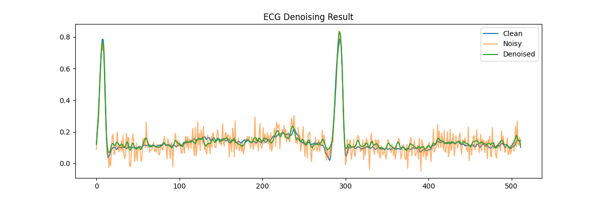

# Fast ECG Denoising using Deep Learning

## 📊 Results

### ECG Signal Comparison

The denoised ECG (green) closely matches the clean ECG while significantly reducing noise.

---

### Training Loss Curve

.png)

The loss decreases steadily during training, indicating successful learning.

---

### Quantitative Performance

| Metric | Value |
|--------|-------|
| MSE (Noisy vs Clean) | 0.0123 |
| MSE (Denoised vs Clean) | 0.0045 |

The denoised signal achieves lower reconstruction error compared to the noisy input.
